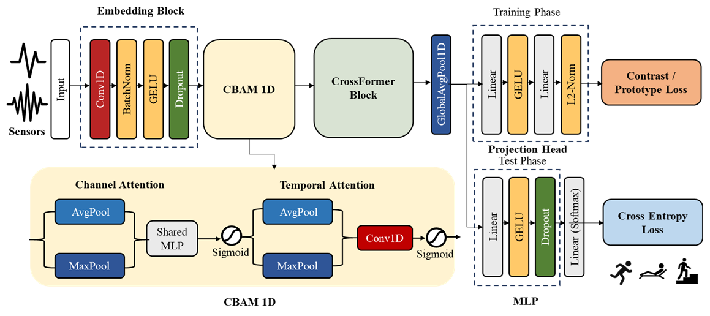

# Contrastive Prototype–Guided CrossFormer for Sensor-Based Human
Activity Recognition

<p align="center"></p>

This repository implements the methodology proposed in the paper "Contrastive Prototype–Guided CrossFormer for Sensor-Based Human
Activity Recognition".


## Model Architecture

The proposed DL model combines CBAM-based denois-
ing, CrossFormer-based long-range temporal modeling, and a
contrastive prototype-guided head. The overall architecture sequentially refines raw multi-channel signals into prototype-aligned representations. Starting
from raw sequences X \in \mathbb{R}^{B \times C \times T} , an input-embedding
module first lifts the signals to a stable high-dimensional
space using learnable 1D convolutions with normalization
and activation, exposing local temporal patterns and inter-
channel correlations to subsequent attention blocks. On top
of this stem, a 1D CBAM suppresses sensor-specific noise
and emphasizes informative channels and time segments prior
to sequence modeling. The resulting feature map is optionally
projected to a working width and then passed to the proposed
Contrast-CrossFormer block. This block injects class-level
priors by cross-attending to a learnable prototype bank, and
further refines the sequence with self-attention and a feed-
forward network, thereby shaping the embedding space to-
ward class-conditioned structure. A prototype-contrastive head
subsequently enforces sample–prototype alignment via an In-
foNCE objective, while a lightweight classifier operating on
temporally pooled features produces the final activity labels.

## Citing this Repository

If you use this code in your research, please cite:

```
@article{Contrastive Prototype–Guided CrossFormer for Sensor-Based Human
Activity Recognition,
  title = {Contrastive Prototype–Guided CrossFormer for Sensor-Based Human
Activity Recognition},
  author={JunYoung Park and Myung-Kyu Yi}
  journal={},
  volume={},
  Issue={},
  pages={},
  year={}
  publisher={}
}
```

## Contact

For questions or issues, please contact:
- JunYoung Park : park91802@gmail.com

## License

This project is licensed under the MIT License - see the [LICENSE](LICENSE) file for details.
